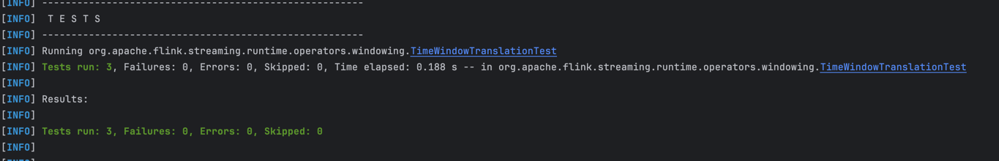
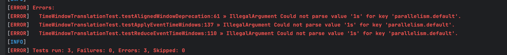

## About This Project
This repo is a fork of [Apache Flink](https://github.com/apache/flink) in which  [openctest](https://www.usenix.org/conference/osdi20/presentation/sun) configuration testing is applied using [cTest4j Tool](https://dl.acm.org/doi/10.1145/3663529.3663799)

## Runninng  Configuration Tests

> **NOTE:** The steps below have been run using **openjdk version 17.0.10** on **macOS Sequoia**.


For demonstration purposes, the steps below simulates testings configuration tests induced failures 
using `TimeWindowTranslationTest` test class inside the `flink-runtime` submodule.
- Clone the project by running the command `git clone git@github.com:kofiarkoh/flink.git`
- Switch to the project directory by running `cd flink`
- Run `mvn clean install -DskipTests  -Denforcer.skip=true -Drat.skip=true` to build the project
- Run the test below using default configuration values as specified in the test file. This test will PASS
```
 mvn surefire:test -pl flink-runtime -Denforcer.skip=true -Dctest.config.save -Dmaven.test.failure.ignore=true -Dtest="org.apache.flink.streaming.runtime.operators.windowing.TimeWindowTranslationTest" -Drat.skip=true
```

- Now lets change one conguration value used in the tests (this value is a valid configuration value). This test will PASS
```
mvn surefire:test -pl flink-runtime -Denforcer.skip=true -Dctest.config.save -Dmaven.test.failure.ignore=true -Dtest="org.apache.flink.streaming.runtime.operators.windowing.TimeWindowTranslationTest" -Dconfig.inject.cli="parallelism.default=1" -Drat.skip=true
```
- To simulate a configuration induced test. Run the command below. _For this step, we set `parallelism.default` to an invalid value `1s` because valid value must be an integer. This test will FAIL because an invalid configuration value is injected into the test case
```
 mvn surefire:test -pl flink-runtime -Denforcer.skip=true -Dctest.config.save -Dmaven.test.failure.ignore=true -Dtest="org.apache.flink.streaming.runtime.operators.windowing.TimeWindowTranslationTest" -Dconfig.inject.cli="parallelism.default=1s" -Drat.skip=true

```

